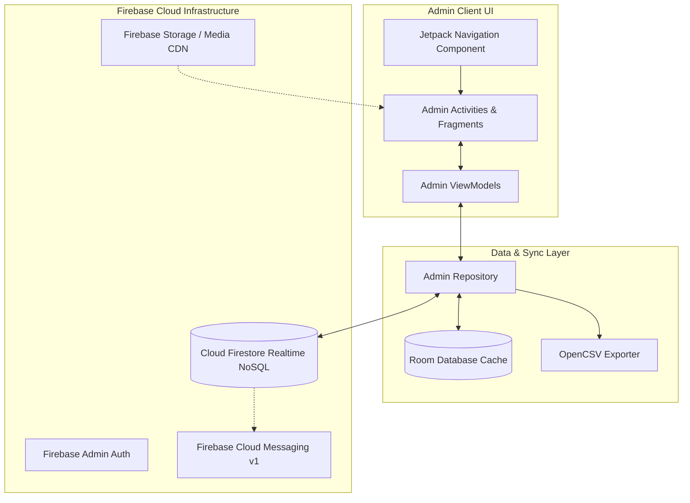
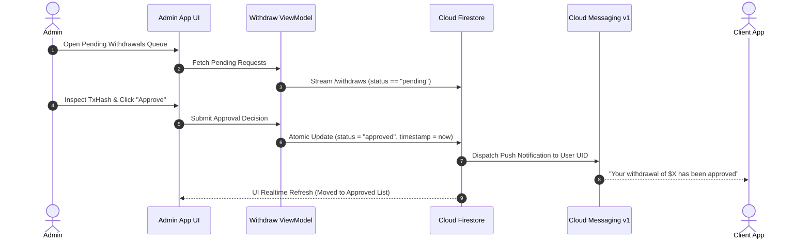

# AI Trust Ledger (Admin Control Panel)

[](https://developer.android.com)
[](https://kotlinlang.org/)
[](https://developer.android.com)
[](https://developer.android.com/topic/architecture)
[](https://firebase.google.com/docs/firestore)
[](LICENSE)

> Mission-critical Android administration console for the AI Trust Ledger ecosystem, offering real-time user moderation, crypto payout approvals, dynamic investment plan configuration, CSV financial auditing, and live support desk management.

---

## 📖 Overview

**AI Trust Ledger Admin** is the central command console engineered for platform operators and compliance teams overseeing the AI Trust Ledger fintech network. Developed using **Kotlin**, **MVVM**, **Android Jetpack Navigation**, and **Room DB**, the application bridges directly with **Firebase Firestore** to monitor active investments, audit liquidity reserves, verify USDT/crypto payout requests, and communicate with users via real-time live support.

### Core Objectives
- **Financial Risk & Liquidity Oversight**: Monitor real-time total balances, daily liabilities, and pending payout queues across all registered investor wallets.
- **Transactional Moderation**: Verify blockchain payment hashes and execute instant approvals or rejections with automated FCM push notifications.
- **Dynamic Plan & Yield Configuration**: Create, edit, activate, or archive multi-category investment plans (Stocks, Forex, Medical) and adjust affiliate MLM tier percentage rewards on the fly without deploying code updates.
- **Real-Time Customer Support Console**: Handle direct inquiries, send broadcast announcements, and publish promotional visual banners to client feeds.

---

## 🏗️ Architecture & Operations Flow

The application follows an **Offline-First MVVM + Repository Architecture** with reactive LiveData streams, background Room caching, and Firestore real-time snapshot listeners.



### Payout Moderation & Audit Workflow



---

## ✨ Core Features

### 1. 📊 Executive Dashboard & Real-Time Metrics
- **Live Platform Stats**: Instant counter cards for Total Users, Active Investors, Total Deposited Capital, and Pending Withdrawal requests.
- **User Directory & Financial Ledger**: Searchable list of all registered users with detailed account snapshots, invested plans, and team statistics.
- **User Creation & Manual Adjustment**: Admin capability to provision user accounts and adjust ledger balances when required.

### 2. 💸 Payout & Withdrawal Workflow Engine
- **Categorized Moderation Tabs**: Dedicated views for `All`, `Pending`, `Approved`, and `Rejected` withdrawal requests.
- **Blockchain Verification**: Inspect user recipient addresses (USDT-BEP20 / TRC20) and verify requested amounts against current user balances.
- **One-Tap Actions**: Approve or reject requests with rejection reasons recorded directly to the user's ledger log.

### 3. ⚙️ Dynamic Plan & Tier Settings Editor
- **Plan Catalog Creator**: Add new investment products specifying title, minimum/maximum deposit amounts, daily yield percentage, duration in days, and category.
- **Live Tier Multipliers**: Configure MLM referral depth, tier bonus percentages, and qualifying criteria dynamically.

### 4. 📢 Broadcasts, Posters & Live Support Desk
- **Visual Poster Banners**: Upload and manage promotional images stored on **Firebase Cloud Storage** that appear on client home sliders.
- **System Announcements**: Broadcast text notifications to all users or specific user segments.
- **Real-Time Customer Service Chat**: Multi-conversation support console allowing administrators to handle user inquiries in real time.

### 5. 📑 Financial Audit & CSV Reporting
- **OpenCSV Integration**: Export filtered withdrawal records, active user balances, and plan purchase histories to standard CSV spreadsheets for offline accounting and auditing.

---

## 📱 Key Screens & Modules

| Module / Fragment | Implementation Class | Description |
|---|---|---|
| **Authentication** | `LoginActivity`, `LauncherActivity`, `SignUpActivity` | Secure administrative authentication with session persistence. |
| **Admin Dashboard** | `HomeFragment` | Real-time overview cards, quick navigation hubs, and pending task alerts. |
| **Withdrawal Desk** | `WithdrawalFragment`, `ApprovedWithdrawalsFragment`, `RejectedWithdrawalsFragment` | Tabbed payout moderation workflow with status updates and audit logs. |
| **User Directory** | `UsersFragment`, `ActiveUsersFragment`, `UsersWithBalanceFragment`, `CreateUserFragment` | User lookup, profile inspection, wallet adjustment, and account creation. |
| **Plan Management**| `InvestmentPlansFragment`, `PlansByCategoryFragment`, `PlanDetailFragment`, `PlanSettingFragment` | Dynamic investment product creation, term configuration, and tier settings. |
| **Broadcast Desk** | `AnnouncementsFragment`, `AddPosterFragment`, `NotificationFragment` | Promotional banner uploads, push notification dispatching, and announcement banners. |
| **Support Center** | `ChatFragment`, `DetailChatFragment` | Real-time administrative chat desk with typing status and read confirmations. |

---

## 🛠️ Technology Stack

| Layer | Technologies / Libraries |
|---|---|
| **Language & Tooling** | Kotlin 2.0, JDK 17/21, Gradle Version Catalogs, Android Gradle Plugin 8.7+ |
| **UI Framework** | Android Jetpack (ViewBinding, Fragment Navigation, Material Components 3, SwipeRefreshLayout) |
| **Architecture** | MVVM, Repository Pattern, Clean Architecture |
| **Local Database** | Android Jetpack Room DB (with KSP code generation) |
| **Backend & Cloud** | Google Firebase (Auth, Cloud Firestore, Cloud Storage, FCM v1 HTTP API) |
| **Reporting & Export** | OpenCSV 5.7.1 for spreadsheet generation |
| **Networking & Media**| OkHttp3, Google OAuth2 Http Client, Glide 4.16, Lottie Animations |

---

## 🚀 Getting Started

### Prerequisites
- **Android Studio Ladybug (2024.2.1+)** or newer.
- **JDK 17** configured in Android Studio.
- **Android SDK 35** installed.
- Firebase project with Admin credentials and Firestore security rules configured.

### Setup & Installation

1. **Clone the Repository**:
   ```bash
   git clone https://github.com/shayann07/AI-Trust-Ledger-Admin.git
   cd AI-Trust-Ledger-Admin
   ```

2. **Configure Local SDK**:
   ```bash
   cp local.properties.example local.properties
   ```
   Add your Android SDK location in `local.properties`.

3. **Firebase Configuration**:
   Place your administrative `google-services.json` file inside the `app/` directory:
   ```text
   app/google-services.json
   ```

4. **Build the Application**:
   ```bash
   # Assemble Debug APK
   ./gradlew assembleDebug

   # Run Unit & Instrumentation Tests
   ./gradlew testDebugUnitTest
   ```

---

## 📄 License

This project is open-source software licensed under the [MIT License](LICENSE) — Copyright (c) 2026 [shayann07](https://github.com/shayann07).
