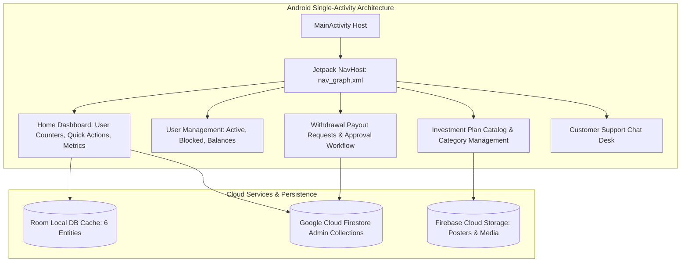

# AI Trust Ledger Admin — Android Cryptocurrency Investment & Administration Control Panel

[](https://kotlinlang.org)
[](https://developer.android.com)
[](https://gradle.org)
[](https://developer.android.com/training/data-storage/room)
[](https://firebase.google.com)
[](LICENSE)

AI Trust Ledger Admin is an enterprise native Android management dashboard application built in Kotlin with Android Jetpack, Room offline database caching, and Google Cloud Firestore backend to provide system operators with full administrative oversight across user portfolios, investment plans, deposit verification, and withdrawal payouts.

---

## Application Architecture & Control Flows



---

## Key Features

- **Executive Metrics Dashboard**: Real-time aggregation of active investors, total deposits, daily ROI liabilities, and pending transactions.
- **User Portfolio Oversight**: Comprehensive user inspector with tools to review user account balances, manual deposit injections, and account locking.
- **Withdrawal Processing Desk**: Tabbed management interface (`All`, `Approved`, `Rejected`) to verify blockchain payout proofs and execute transaction approval states.
- **Investment Plan Catalog Manager**: Dynamic creation and configuration of investment packages, lock-in terms, minimum deposit thresholds, and daily profit yields.
- **Customer Support & Announcements**: In-app two-way support chat and Firebase Cloud Storage poster broadcast system.

---

## Technical Stack

| Component | Library / Framework | Version |
|---|---|---|
| **Language** | Kotlin | 2.1.10 |
| **Build System** | Android Gradle Plugin / Gradle | 8.9.2 / 8.11.1 |
| **SDK Levels** | Compile SDK: 35, Target SDK: 35, Min SDK: 24 | Android 7.0+ |
| **Navigation & UI** | Jetpack Navigation Component + ViewBinding | 2.7.7 |
| **Local Database** | AndroidX Room (Entities, DAOs, Converters) | 2.7.0 |
| **Cloud Services** | Firebase Auth, Cloud Firestore, Cloud Storage, Messaging | 23.2.0 / 25.1.3 |
| **Networking & Serialization** | OkHttp 4 + Gson + Retrofit | 4.12.0 / 2.12.1 |

---

## Setup & Local Development

### Prerequisites
- Android Studio Ladybug (2024.2.1+) or newer
- JDK 17 / Java 11 runtime
- Android SDK 35 installed

### Step-by-Step Configuration

1. **Clone the Repository:**
   ```bash
   git clone https://github.com/shayann07/AI-Trust-Ledger-Admin.git
   cd AI-Trust-Ledger-Admin
   ```

2. **Configure Firebase Credentials:**
   Copy the example configuration template:
   ```bash
   cp app/google-services.json.example app/google-services.json
   ```

3. **Configure Local SDK:**
   ```bash
   cp local.properties.example local.properties
   ```

4. **Build the Application:**
   ```bash
   ./gradlew assembleDebug
   ```

---

## Repository Structure

```
AI-Trust-Ledger-Admin/
├── app/
│   ├── src/main/
│   │   ├── java/com/trustledger/adminaitrust/
│   │   │   ├── adapters/       # 14 Recycler adapters (Users, Withdrawals, Plans)
│   │   │   ├── database/       # Room database holder, 6 DAOs, 6 Models
│   │   │   ├── fragments/      # 15 Admin feature fragments
│   │   │   ├── helper/         # FirebaseHelper, QR & CSV utilities
│   │   │   ├── notifications/  # FCM Notification and AccessToken services
│   │   │   └── ui/             # LauncherActivity, LoginActivity, MainActivity
│   │   ├── res/                # Layouts, navigation graph, drawables
│   │   └── AndroidManifest.xml # Entry points, permissions
│   ├── google-services.json.example
│   └── build.gradle.kts
├── local.properties.example
├── LICENSE                     # MIT License
└── README.md
```

---

## License

Distributed under the MIT License. See [LICENSE](LICENSE) for more information.

Copyright (c) 2026 **shayann07**
